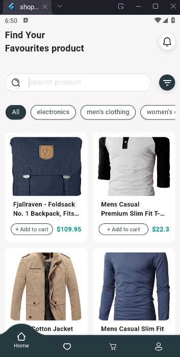
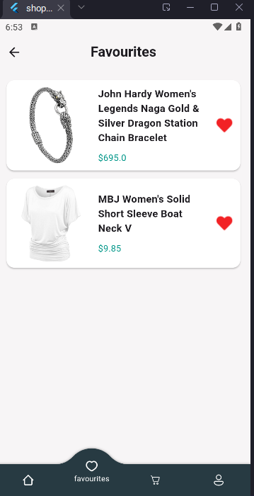
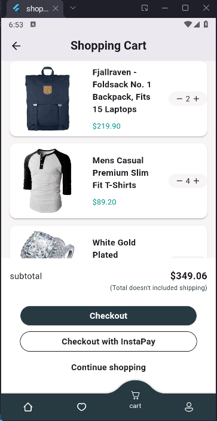
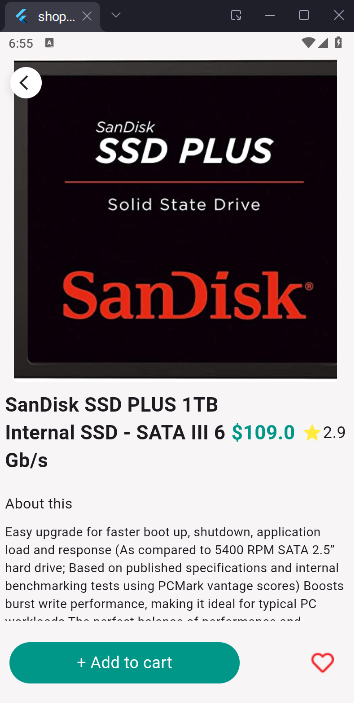
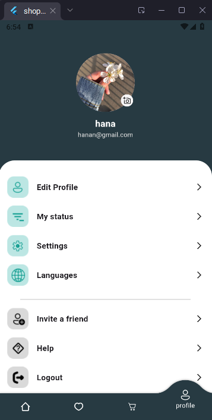
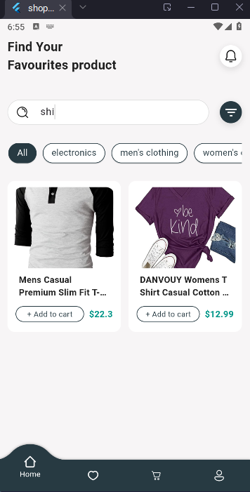

#  Store App

A Flutter shopping app for electronics, jewelry, and clothing (men & women).  
Built using Firebase and REST API.

##  Features

-  Login using Firebase Authentication  
-  Logout functionality  
-  Upload and change profile photo   
-  Fetch product data from external REST API
-  View product details (title, price, description, image, rating)
-  Filter products by category  
-  Search for products  
-  Add to cart  
-  Add to favorites
  
##  How It Works

- User logs in using Firebase Authentication.
- App fetches product data from external REST API
- User can search, filter by category, and view product details.
- User can add items to cart and favorites.
- Profile photo is uploaded and changed
  
##  API Source

Product data is fetched from the public endpoint:  
[`https://fakestoreapi.com/products`](https://fakestoreapi.com/products)

##  Screenshots

| Home | Favorites | Cart |
|------|-----------|------|
|  |  |  |

| Details | Profile | Search |
|---------|---------|--------|
|  |  |  |

##  Getting Started

1. Clone the repository:
   ```bash
   git clone https://github.com/hanahatem1/store_app

 ##  Packages Used

- [`firebase_core`](https://pub.dev/packages/firebase_core) – Firebase initialization  
- [`firebase_auth`](https://pub.dev/packages/firebase_auth) – User authentication  
- [`firebase_storage`](https://pub.dev/packages/firebase_storage) – Upload profile images  
- [`cloud_firestore`](https://pub.dev/packages/cloud_firestore) – Firestore integration (if used)  
- [`image_picker`](https://pub.dev/packages/image_picker) – Pick images from gallery or camera  
- [`image`](https://pub.dev/packages/image) – Image processing  
- [`flutter_bloc`](https://pub.dev/packages/flutter_bloc) – BLoC state management  
- [`bloc`](https://pub.dev/packages/bloc) – Core BLoC functionality  
- [`equatable`](https://pub.dev/packages/equatable) – Value comparison for BLoC  
- [`dio`](https://pub.dev/packages/dio) – HTTP client for API requests  
- [`convex_bottom_bar`](https://pub.dev/packages/convex_bottom_bar) – Stylish bottom navigation bar  
- [`another_flushbar`](https://pub.dev/packages/another_flushbar) – Custom snackbars / alerts  
- [`flutter_spinkit`](https://pub.dev/packages/flutter_spinkit) – Loading indicators  
- [`shimmer`](https://pub.dev/packages/shimmer) – Skeleton loading effect  
- [`cupertino_icons`](https://pub.dev/packages/cupertino_icons) – iOS-style icons  
  
